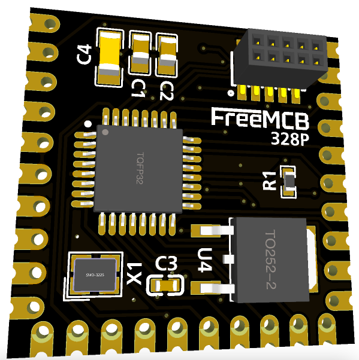

# FreeMCB328P

The FreeMCB328P is a versatile and cost-effective microcontroller unit (MCU) designed for a range of applications, from hobbyist projects to industrial use. This square-shaped castellated tiny PCB is based on the Atmel ATmega328P microcontroller, ensuring compatibility with the Arduino Uno platform.

    

## Key Features

- **ATmega328P Microcontroller**: The FreeMCB328P utilizes the Atmel ATmega328P microcontroller, a versatile 8-bit microcontroller with a 16 MHz clock speed. It offers 32 KB of flash memory, 2 KB of SRAM, and 1 KB of EEPROM, providing ample space for code and data storage.

- **Digital I/O Pins**: The FreeMCB328P boasts 28 digital I/O pins, 14 of which can be used as pulse-width modulation (PWM) outputs. These pins can be configured as input or output pins, allowing for interfacing with various sensors, actuators, and displays.

- **Analog Inputs**: The MCU features 8 analog inputs, enabling the measurement of analog signals from sensors like potentiometers, thermistors, and light sensors. These analog inputs provide a resolution of 10 bits, allowing for accurate measurements.

- **Communication Protocols**: The FreeMCB328P supports a variety of communication protocols, including SPI, I2C, and UART. These protocols enable communication with external devices, such as displays, sensors, and actuators.

- **Arduino Uno Compatibility**: The FreeMCB328P is compatible with the Arduino Uno bootloader, making it easy to program using the widely popular Arduino IDE. This compatibility opens up a vast library of Arduino sketches and resources.

- **Low Power Consumption**: The FreeMCB328P is designed for low power consumption, making it suitable for battery-powered applications. Its power consumption can be further optimized through software techniques.

## Physical Specifications

- **Square-Shaped Castellated Tiny PCB**: The FreeMCB328P comes in a compact, square-shaped castellated tiny PCB, measuring 18.0 mm x 18.0 mm x 1.6 mm. This small form factor makes it ideal for space-constrained applications.

- **SMD Components**: All components on the FreeMCB328P are surface-mount devices (SMDs), resulting in a clean and compact design. This eliminates the need for DIP or TH components, simplifying assembly and reducing the overall size of the board.

## Applications

The FreeMCB328P's versatility and ease of use make it suitable for a wide range of applications, including:

- **Hobbyist Projects**: The FreeMCB328P is a popular choice for hobbyists due to its low cost, ease of programming, and compatibility with the Arduino Uno ecosystem. It can be used for a variety of beginner-friendly projects, such as LED control, temperature measurement, and simple robotics.

- **Robotics**: The FreeMCB328P's I/O pins and communication protocols make it well-suited for robotics applications. It can be used to control motors, read sensors, and send data to other devices, forming the core of a robotic system.

- **Data Logging**: The FreeMCB328P's analog inputs and data storage capabilities enable it to be used for data logging applications. It can be used to collect data from sensors, such as temperature, pressure, or humidity, and store it in its EEPROM or transmit it to a host computer for analysis.

- **Industrial Control**: The FreeMCB328P's reliability and communication protocols make it suitable for industrial control applications. It can be used to monitor and control industrial machinery, such as pumps, valves, and conveyors.

- **Home Automation**: The FreeMCB328P's versatility and low power consumption make it ideal for home automation projects. It can be used to control lights, appliances, and smart home devices, creating an intelligent and interconnected home environment.

- **Wearable Electronics**: The FreeMCB328P's small form factor and low power consumption make it suitable for wearable electronics applications. It can be used to collect data from sensors embedded in wearable devices, such as fitness trackers and smartwatches.

## License

This project is licensed under the **CERN Open Hardware Licence Version 2 - Strongly Reciprocal**. You are free to use, modify, and distribute the FreeMCB328P for your projects, provided that any derived work is also made available under the same license. See the [full text of the license](LICENSE) for detailed terms and conditions.